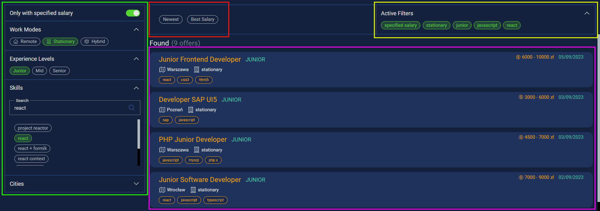

# $\color{orange}{Job\ Search}$ _- IT job offers in one place_

Job Search is an web app which collects IT job offers from several websites, clears them from unnecessary information and presents them in an accessible way.

## [🔗 CLICK TO SEE IT LIVE](https://jobsearch.rafaljagielski.pl)

## $\color{orange}{Table\ of\ Contents}$

⚓ [General Informations](#general-informations) 
⚓ [Technologies](#technologies) 
⚓ [Usage](#usage) 
⚓ [License](#license)

## $\color{orange}{General\ Informations}$

The application consists of a backend and frontend part.
The backend is responsible for obtaining information about job offers from other websites, unifying it into a common format and serving it via API.
The frontend part retrieves data from the backend, displays it in a simple form and adds the ability to filter and sort offers.
**At the moment, the application supports the following websites:**

🔗 [Just Join It](https://justjoin.it/) 
🔗 [Theprotocol](https://theprotocol.it/) 
🔗 [Pracuj.pl](https://www.pracuj.pl/)

## $\color{orange}{Technologies}$

List of technologies used to build the app:

**Backend:**

🔗 [typescript] - strongly typed programming language that builds on JavaScript. 
🔗 [node.js] - open-source, cross-platform JavaScript runtime environment. 
🔗 [express.js] - fast, unopinionated, minimalist web framework for Node.js. 
🔗 [puppeteer] - Node.js library which provides a high-level API to control Chrome/ Chromium over the DevTools Protocol. 
🔗 [node-cron] - tiny task scheduler in pure JavaScript for node.js. 
🔗 [axios] - promise-based HTTP Client for node.js and the browser. 

**Frontend:**

🔗 [typescript] - strongly typed programming language that builds on JavaScript. 
🔗 [vue3] - an approachable, performant and versatile framework for building web user interfaces. 
🔗 [axios] - promise-based HTTP Client for node.js and the browser. 
🔗 [vite] - frontend build tooling that significantly improves the frontend development. 
🔗 [vue-uuid] - uuid generator for vue. 
🔗 [heroicons-vue] - a set of free MIT-licensed high-quality SVG icons as Vue functional components. 

## $\color{orange}{Usage}$

- $\color{green}{\textrm{Marked\ by\ green\ rectangle\ are\ available\ filters.}}$
- $\color{red}{\textrm{Marked\ by\ red\ rectangle\ are\ sorting\ options.}}$
- $\color{yellow}{\textrm{Marked\ by\ yellow\ rectangle\ are\ active\ filters.}}$
- $\color{#ff00ff}{\textrm{Marked\ by\ purple\ rectangle\ is\ list\ of\ job\ offers\ that\ meets\ selected\ filters.}}$

## $\color{orange}{License}$

MIT

[typescript]: https://www.typescriptlang.org/
[node.js]: https://nodejs.org
[express.js]: https://expressjs.com/
[puppeteer]: https://pptr.dev/
[node-cron]: https://www.npmjs.com/package/node-cron
[axios]: https://axios-http.com
[vue3]: https://vuejs.org
[vite]: https://vitejs.dev/
[vue-uuid]: https://www.npmjs.com/package/vue-uuid
[heroicons-vue]: https://vue-hero-icons.netlify.app
